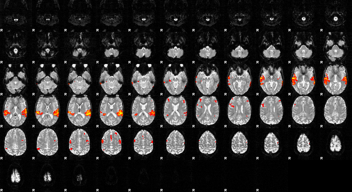
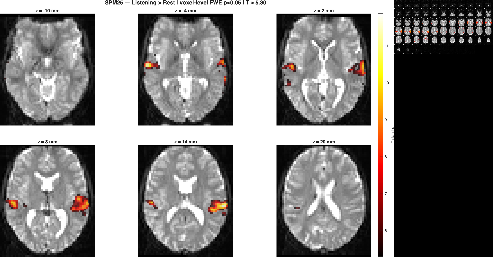

# Task fMRI — SPM25 First-Level (Auditory) + FSL FEAT replication

**One-line:** Single-subject block-design task-fMRI analysis of the classic SPM Auditory dataset, implemented independently in SPM25 and FSL FEAT for a reproducibility-oriented cross-software comparison.

## Status
- **SPM25 first-level analysis:** complete
- **FSL FEAT first-level replication:** complete
- **Contrast:** `Listening > Rest`
- **Cross-software comparison:** complete

## Data
- Dataset: **SPM Auditory / MoAEpilot** tutorial dataset
- Subject: **sub-01**
- Functional input: **84 analysis volumes**
- TR: **7 s**
- Design: block-design auditory stimulation versus rest
- Raw neuroimaging data are not committed to this repository

See `DATA_SOURCES.md`.

## SPM25 workflow
1. Realignment and reslicing
2. Slice-timing correction: 64 slices, descending `64:-1:1`, reference slice 32
3. T1-to-mean-EPI coregistration
4. T1 segmentation and deformation estimation
5. Functional normalization to MNI space at 3 mm isotropic resolution
6. Spatial smoothing: 6 mm FWHM
7. First-level GLM with the listening condition and 6 motion nuisance regressors
8. Contrast: **Listening > Rest**
9. Whole-brain voxel-level FWE inference

### SPM statistical result
- Threshold: **voxel-level FWE p < 0.05**
- T threshold: **5.296299**
- Extent threshold: **0 voxels**

Largest SPM clusters:

| Cluster size | Peak T | MNI x | MNI y | MNI z |
|---:|---:|---:|---:|---:|
| 403 | 11.8681 | -63 | -28 | 14 |
| 213 | 11.8743 | 57 | -22 | 11 |

## FSL FEAT workflow
1. MCFLIRT motion correction
2. Regular-descending slice-timing correction
3. BET functional and structural brain extraction
4. SUSAN smoothing: 6 mm FWHM
5. High-pass filter: 128 s
6. FILM first-level model with prewhitening
7. Double-gamma HRF and the same block timings as the SPM model
8. Six MCFLIRT motion nuisance EVs
9. Functional-to-T1 FLIRT registration, 6 DOF
10. T1-to-MNI152 FLIRT registration, 12 DOF
11. Contrast: **Listening > Rest**
12. Cluster inference: **Z > 3.1**, cluster significance **p < 0.05**

### FSL statistical result
The two dominant FEAT clusters reproduced the expected bilateral auditory pattern:

| Cluster size | Z max | MNI x | MNI y | MNI z | Cluster p |
|---:|---:|---:|---:|---:|---:|
| 863 | 10.5 | -61.1 | -27.0 | 8.85 | 1.77e-35 |
| 718 | 10.3 | 58.7 | -22.8 | 5.68 | 2.85e-31 |

The full FSL cluster table is stored in `results/tables/table2_fsl_clusters.txt`.

## Results

### Fig 0 — SPM motion QC

### Fig 1 — SPM thresholded activation

### Fig 2 — SPM maximum-intensity projections

### Fig 3 — FSL FEAT thresholded activation

### Fig 4 — SPM versus FSL

## Interpretation
Both software packages identified strong bilateral activation around superior temporal/auditory regions for `Listening > Rest`. The peak coordinates and dominant hemispheric pattern were similar, but the outputs are not numerically interchangeable because SPM and FEAT used different HRF implementations, temporal models, registration strategies, statistical images, and thresholding frameworks.

This project therefore demonstrates conceptual replication rather than exact voxelwise equivalence.

## Tables and metadata
- SPM peaks: `results/tables/table1_spm_peaks.csv`
- SPM settings: `results/tables/spm_threshold_info.txt`
- FSL clusters: `results/tables/table2_fsl_clusters.txt`
- FSL settings: `results/tables/fsl_threshold_info.txt`

## Reproducibility
- Environment: `env/TOOL_VERSIONS.md`
- Data provenance: `DATA_SOURCES.md`
- Mini-report: `reports/report.md`

## Limitations
- Single-subject tutorial dataset
- No group-level inference
- SPM used voxel-level FWE inference, whereas FEAT used cluster-based inference; cluster sizes and significance values should not be compared directly
- FSL standard-space registration used affine FLIRT rather than nonlinear registration
- No atlas-based anatomical labeling was applied automatically

## Cite this work
- Concept DOI: **10.5281/zenodo.17715106**
- See `CITATION.cff`
