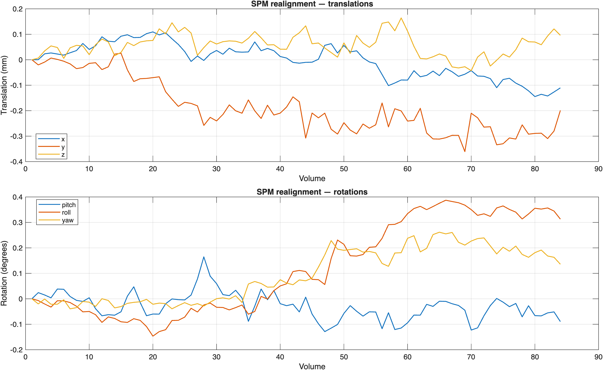
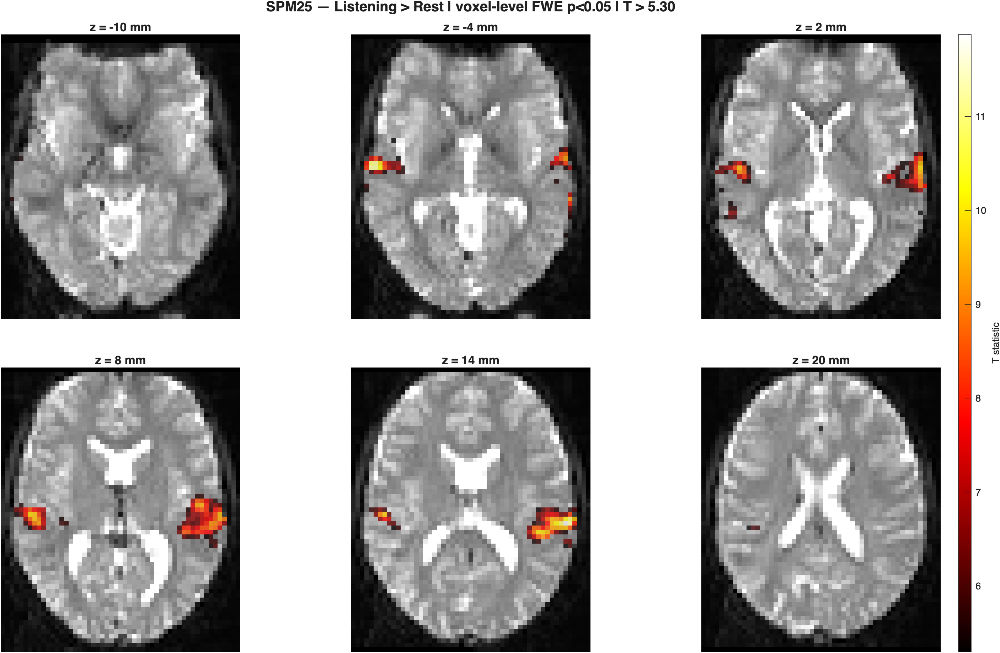
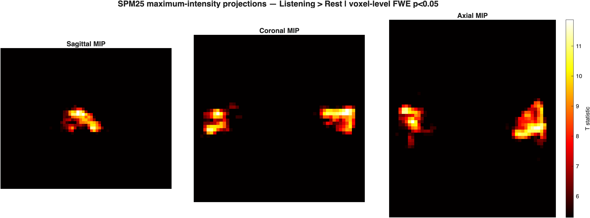

# Task fMRI — SPM25 First-Level (Auditory) + FSL FEAT replication

**One-line:** Single-subject block-design task-fMRI analysis of the classic SPM Auditory dataset in SPM25, with a planned FSL FEAT replication of the same contrast.

---

## Status
- **SPM25 first-level analysis:** complete
- **FSL FEAT replication:** next milestone
- **Contrast:** `Listening > Rest`

## Overview
This portfolio project reproduces the classic **SPM Auditory** first-level GLM for one subject. The SPM analysis is complete and includes preprocessing, motion nuisance regressors, first-level model estimation, a positive auditory contrast, whole-brain statistical thresholding, QC output, activation figures, and a peak table.

The next stage will replicate the same task contrast in **FSL FEAT** so that the two software ecosystems can be compared within a single reproducibility-oriented project.

## Data & subset
- Dataset: **SPM Auditory / MoAEpilot** tutorial dataset
- Subject: **sub-01**
- Functional input: **84 analysis volumes** in the downloaded BIDS/NIfTI series
- TR: **7 s**
- Design: block-design auditory stimulation versus rest
- Raw neuroimaging data are **not committed** to this repository

See `DATA_SOURCES.md`.

## SPM25 pipeline
1. Realignment (estimate and reslice)
2. Slice-timing correction: **64 slices**, descending order `64:-1:1`, reference slice **32**
3. T1-to-mean-EPI coregistration
4. T1 segmentation and deformation estimation
5. Functional normalization to MNI space at **3 × 3 × 3 mm**
6. Spatial smoothing: **6 mm FWHM**
7. First-level GLM with the `listening` condition and **6 realignment parameters** as nuisance regressors
8. Contrast: **Listening > Rest**
9. Whole-brain voxel-level inference

## Statistical result
The SPM result survived **voxel-level whole-brain FWE correction at p < 0.05**:

- T threshold: **5.296299**
- Extent threshold: **0 voxels**
- Contrast: **Listening > Rest**

The two largest suprathreshold clusters had peaks at:

| Cluster size (voxels) | Peak T | MNI x | MNI y | MNI z |
|---:|---:|---:|---:|---:|
| 213 | 11.8743 | 57 | -22 | 11 |
| 403 | 11.8681 | -63 | -28 | 14 |

The full peak table is available at `results/tables/table1_spm_peaks.csv`.

## Results
### QC — realignment parameters
`results/figures/fig0_spm_motion_qc.png`

### Fig 1 — thresholded SPM activation map
`results/figures/fig1_spm_activation_map.png`

### Fig 2 — maximum-intensity projections
`results/figures/fig2_spm_mip.png`

### Tables
- Peak coordinates and cluster sizes: `results/tables/table1_spm_peaks.csv`
- Threshold and model metadata: `results/tables/spm_threshold_info.txt`

## Reproducibility
- Environment and software: `env/TOOL_VERSIONS.md`
- Data provenance: `DATA_SOURCES.md`
- Mini-report: `reports/report.md`
- Statistical settings used for the published outputs are recorded in `results/tables/spm_threshold_info.txt`

## Next milestone — FSL FEAT replication
Replicate the same **Listening > Rest** first-level task contrast in FSL FEAT and compare the resulting activation pattern, preprocessing choices, and statistical outputs with the completed SPM25 analysis.

## Limitations
- Single-subject tutorial dataset
- No group-level inference
- Cross-software comparison is pending until the FSL FEAT replication is complete
- Anatomical labels are not assigned to the peak table unless an explicit atlas-based labeling step is added

## Cite this work
- Concept DOI: **10.5281/zenodo.17715106**
- See `CITATION.cff`
